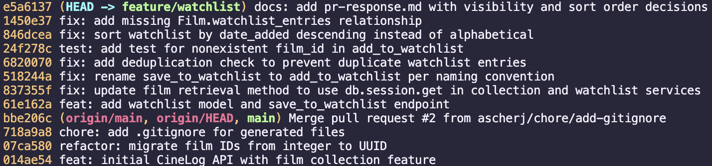

# PR Response Doc — CineLog Watchlist Feature

## AI Usage
I used AI (Claude Code) throughout this project in a few specific ways:
- **Codebase orientation & mechanical edits:** Had AI locate every call site of `save_to_watchlist()` and apply the rename to `add_to_watchlist()` (Comment 1), and used it to scaffold the `AlreadyInWatchlistError`/`404`/`409` handling in the route once I'd already written the dedup check in the service layer (Comment 2).
- **Review pass on my own code:** After writing the deduplication check and the `test_watchlist.py` fixtures myself, I asked AI to review both for mistakes before I ran them (Comments 2 and 3).
- **Stress-testing my Comment 5 argument:** Asked AI to argue the opposite side of my sort-order decision. It raised the browsability tradeoff (old entries sinking to the bottom) before I'd written that paragraph, so I added it. I kept my own framing (watchlist is forward-looking) as the lead argument rather than adopting AI's phrasing wholesale.
- **Rewriting commit history (Milestone 4):** My rebase in Comment 6 had left the history messy — a dropped-then-recreated `WatchlistEntry` model, a mislabeled commit that bundled the sort-order fix with the model recovery and stale docstrings, and `pr-response.md` edits scattered across five separate commits. I used AI to reconstruct the branch from `origin/main` using the actual diffs from my original commits, regrouped into one logical change per commit, and verified the resulting code was byte-for-byte identical to my pre-rebase final state (`git diff` against a backup branch showed no differences) before running the full test suite again.

## Comment 1 — Rename
**What I did:**
I first located the line that needed renaming, then had AI rename `save_to_watchlist()` to `add_to_watchlist()` across all call sites.
**How I verified:**
I had AI search the codebase and run the code to confirm every reference to the old name was updated and nothing was left inconsistent.

## Comment 2 — Deduplication
**What I did:**
I first looked at `add_to_collection()` to understand how the project handled duplicate entries. I then implemented the same pattern in `add_to_watchlist()` on my own. After finishing, I used AI to review my implementation and help correct a few mistakes. I also added an `AlreadyInWatchlistError` exception and updated the watchlist route to catch it and return a `409 Conflict`, matching the behavior used by the collection route.
**How I verified:**
I ran the Flask app locally and used curl to hit the real `/watchlist/<user_id>/add` endpoint: added a film (201), added the same film again and got the expected 409 with no duplicate row created in the database. I also checked that a nonexistent film still returns 404, and that a different user adding the same film still succeeds (dedup is scoped per-user, not global).

## Comment 3 — Missing test
**What I did:**
I added the test calling `add_to_watchlist()`, using similar logic to how I renamed it in Comment 1, then added `@pytest.fixture` for `app` and `sample_user` since the test needs its own app context and test user. Afterwards I used AI to check my work.

**How I verified:**
Ran `pytest tests/test_watchlist.py -v` on its own — `test_add_to_watchlist_nonexistent_film_raises` passed, confirming `add_to_watchlist()` raises `FilmNotFoundError` for a fake film id instead of hitting a database error. Then ran `pytest tests/ -v` for the full suite: 5 passed, 0 errors (the 4 existing collection tests plus the new watchlist test), so the new test file didn't break anything else.

## Comment 4 — Default visibility
**My position:**
I changed the default from `public=True` to `public=False` in `models.py`. Watchlist entries should be private unless a user explicitly opts to share them.

**Reasoning:**
Watchlists often hold things people don't want visible right away — an aspirational pick, a guilty pleasure, something for a class. Defaulting to private lets users add freely without worrying it's exposed before they've chosen to share it, and a private entry can always be made public later with no harm done.

**Tradeoff acknowledged:**
This costs us social discovery out of the box — a "friend activity" style feed would start empty and rely on users manually opting in, which most won't do. I'm accepting that since an unwanted public exposure is worse for a user than a feed that fills up slowly.

## Comment 5 — Sort order
**My position:**
Going with the maintainer's preference: `get_watchlist()` now sorts by `date_added.desc()` (newest first) instead of `Film.title.asc()`.

**Reasoning:**
A watchlist is forward-looking — it's what a user wants to watch *next*, and that's usually whatever they added most recently, not whatever starts with "A." This also matches `get_collection()`, which already sorts by `date_added.desc()`, so both list endpoints follow one convention.

**Engagement with reviewer's point:**
The maintainer's point is that date-added sorting surfaces what a user just decided to watch, which alphabetical order buries. I agree, since that's exactly the watchlist's use case. The tradeoff is that older entries sink to the bottom and get harder to rediscover — a real cost since `/watchlist/<user_id>` has no filtering like `/films/` does. I'm accepting that cost rather than adding a `?sort=` param, since that's new API surface beyond what this comment is asking for; it's a reasonable follow-up if the list ever grows large enough to matter.

**AI stress-test:** Asked AI to argue against my draft. It flagged the browsability tradeoff (old entries becoming unreachable) before I'd written it in, so I added that paragraph. It also questioned whether the `get_collection` comparison was doing too much work as an argument — I kept it as secondary support but led with the watchlist's own use case instead.

## Comment 6 — Rebase
**What conflicted:**
My branch was created before main's UUID refactor, so `.gitignore` had a small add/add conflict, and my `WatchlistEntry` model still stored `film_id` as an integer while `Film.id` on main is now a UUID string. A couple of docstrings also still described `film_id` as an int.

**How I resolved it:**
Merged the `.gitignore` lines, changed `film_id` to match `Film.id`'s UUID type, and updated the stale docstrings. My first attempt at this rebase actually dropped the `WatchlistEntry` model entirely without me noticing until `watchlist_service.py` was importing a class that no longer existed — I aborted that attempt and redid it cleanly rather than patching it. I also found and fixed one more pre-existing bug along the way: `Film` had no relationship back to `WatchlistEntry`, so `get_watchlist()` crashed on any non-empty list. Fixed that the same way `CollectionEntry` already does it.

**How I verified no conflict remains:**
Ran the full test suite (5 passed). Since the existing watchlist test only covers the "film not found" case, I also manually ran through the actual save/fetch path with a real UUID to make sure the fix held. Checked `git log --merges` against main and got nothing back, confirming the rebase didn't leave any merge commits.



## PR Description

### What this adds
This PR adds a **watchlist** feature to CineLog, alongside the existing collection feature. Users can save films they want to watch later, view their watchlist, and won't accidentally add the same film twice.

**New endpoints:**
- `POST /watchlist/<user_id>/add` — add a film to a user's watchlist. Body: `{ "film_id": "<uuid>" }`. Returns `201` on success, `404` if the film doesn't exist, `409` if it's already on that user's watchlist.
- `GET /watchlist/<user_id>` — return a user's watchlist, newest addition first.

**New model:** `WatchlistEntry` (`models.py`) — `user_id`, `film_id`, `date_added`, and a `public` flag, following the same shape as `CollectionEntry`.

### Design decisions
1. **Default visibility (Comment 4):** `WatchlistEntry.public` defaults to `False`. Watchlist entries are private unless a user explicitly makes them public — an aspirational pick or guilty-pleasure addition shouldn't be visible to others by default. The tradeoff is that a "friend activity" feed built on this would start empty and rely on opt-in sharing; I'm accepting that in favor of avoiding unwanted exposure.
2. **Sort order (Comment 5):** `get_watchlist()` sorts by `date_added.desc()` (newest first) rather than alphabetically by title. A watchlist is forward-looking — what a user just decided to watch next — and this also matches the existing `get_collection()` sort convention. The tradeoff is that older entries sink and become harder to rediscover without a filter/sort param; a `?sort=` option would be a reasonable follow-up if that becomes a real problem.

### How to manually test
1. Install dependencies and start the app:
   ```bash
   pip install -r requirements.txt
   python app.py
   ```
2. Grab a real `user_id` and `film_id` (e.g. from `GET /films/` and a user already in the DB, or create one via the existing user flow).
3. Add a film to the watchlist:
   ```bash
   curl -X POST http://localhost:5000/watchlist/<user_id>/add \
     -H "Content-Type: application/json" \
     -d '{"film_id": "<film_id>"}'
   ```
   Expect `201` with the new entry, `"public": false`.
4. View the watchlist:
   ```bash
   curl http://localhost:5000/watchlist/<user_id>
   ```
   Expect the film you just added, newest-first if you add more than one.
5. Add the same film again — expect `409 Conflict` and no duplicate row.
6. Try a nonexistent `film_id` — expect `404`.
7. Add the same `film_id` under a *different* `user_id` — expect `201` (dedup is scoped per-user, not global).
8. Run the automated test suite:
   ```bash
   pytest tests/ -v
   ```
   Expect all 5 tests to pass (4 existing collection tests + the new watchlist test).